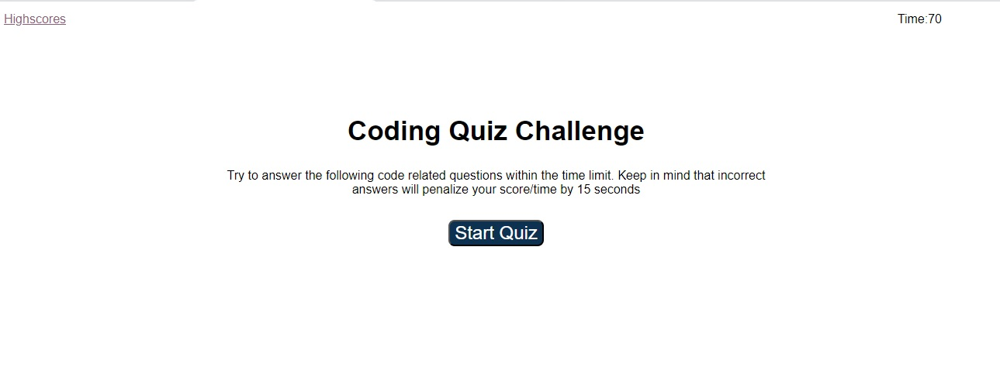

# 04 Web APIs: Code Quiz

## Your Task

An application includes multiple-choice questions and timer. This app will run in the browser and will feature dynamically updated HTML and CSS powered by JavaScript code. It has a clean and polished, responsive user interface that adapts to multiple screen sizes.


## User Story

```
AS A coding boot camp student
I WANT to take a timed quiz on JavaScript fundamentals that stores high scores
SO THAT I can gauge my progress compared to my peers
```

## Acceptance Criteria

```
GIVEN I am taking a code quiz
WHEN I click the start button
THEN a timer starts and I am presented with a question
WHEN I answer a question
THEN I am presented with another question
WHEN I answer a question incorrectly
THEN time is subtracted from the clock
WHEN all questions are answered or the timer reaches 0
THEN the quiz is over
WHEN the quiz is over
THEN I can save my initials and my score
```

## Mock-Up

The following images demonstrates the application functionality:

* Start Quiz




* Display multiple choice questions


* Enter initials and submit


* Scorelist in descending order


## URL of application

[https://sakshiarora04.github.io/quiz/](https://sakshiarora04.github.io/quiz/)
